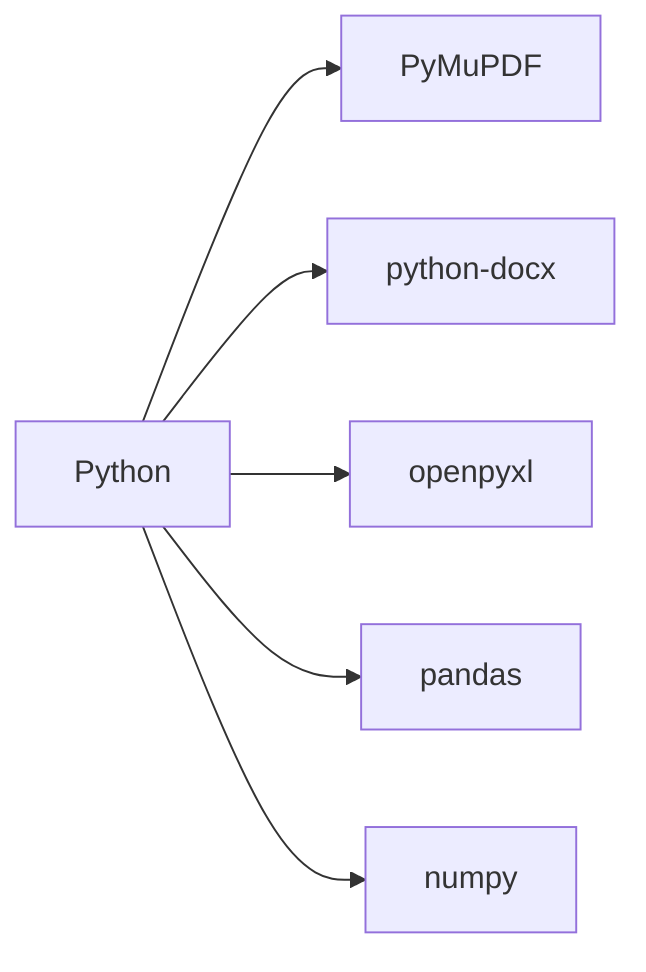

# 🧪🔍 Analisador de Artigos Científicos sobre Nanopartículas

<p align="center">
  
  
  
</p>

> Ferramenta para análise automatizada de artigos científicos em PDF sobre nanotecnologia, com geração de relatórios estruturados

## 📌 Índice
- [Funcionalidades](#-funcionalidades)
- [Tecnologias](#-tecnologias)
- [Instalação](#-instalação)
- [Como Usar](#-como-usar)
- [Estrutura do Projeto](#-estrutura-do-projeto)
- [Saída Esperada](#-saída-esperada)
- [Contribuição](#-contribuição)
- [Licença](#-licença)

## 🚀 Funcionalidades

### 🔬 Extração de Dados
| Categoria              | Dados Extraídos                     |
|------------------------|-------------------------------------|
| **Nanopartículas**     | Nome, tamanho médio, composição     |
| **Fabricação**         | Técnicas, condições experimentais   |
| **Aplicações**         | Setores, eficácia descrita          |
| **Propriedades**       | Físicas, químicas, biológicas       |
| **Patentes**           | Números, titulares, países          |

### 📂 Saídas Geradas
```diff
+ 📄 Relatório Word (.docx)
  - Análise individual por artigo
  - Tabelas comparativas
  - Destaques científicos

+ 📊 Planilha Excel (.xlsx)
  - Resumo consolidado
  - Gráficos automáticos (barras, pizza)
  - Filtros avançados
```

## 💻 Tecnologias



## 📥 Instalação

1. Clone o repositório:
```bash
git clone https://github.com/seu-usuario/nano-analyser.git
cd nano-analyser
```

2. Crie um ambiente virtual (recomendado):
```bash
python -m venv venv
source venv/bin/activate  # Linux/Mac
.\venv\Scripts\activate   # Windows
```

3. Instale as dependências:
```bash
pip install -r requirements.txt
```

## 🛠️ Como Usar

1. Coloque seus PDFs na pasta `artigos/`
2. Execute o script principal:
```bash
python main.py
```
3. Acesse os resultados em `resultados/`

Exemplo de código:
```python
from analisador import NanoAnalisador

analisador = NanoAnalisador()
dados = analisador.processar_artigos('artigos/')
analisador.gerar_relatorios(dados)
```

## 📁 Estrutura do Projeto

```
projeto_nano/
├── 📜 main.py                     # Ponto de entrada
├── 📂 analisador/                 # Módulos principais
│   ├── 📜 __init__.py             # Pacote Python
│   ├── 📜 leitor_pdf.py           # Extração de texto
│   ├── 📜 extrator_info.py        # Processamento NLP
│   ├── 📜 relatorio_word.py       # Geração Word
│   └── 📜 relatorio_excel.py      # Geração Excel
├── 📂 artigos/                    # PDFs de entrada
├── 📂 resultados/                 # Arquivos gerados
├── 📜 .gitignore                  # Configuração Git
└── 📜 README.md                   # Documentação
```

## 📜 Licença

Este projeto está licenciado para fins **acadêmicos**. Consulte o arquivo [LICENSE](LICENSE) para detalhes.

---

<p align="center">
  Desenvolvido com 💙 & ☕ por <b>Lhara Raysa</b> | Transformando ideias em código
</p>
