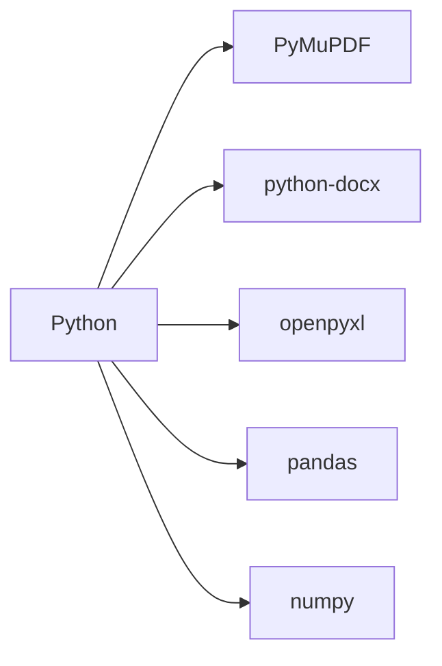

# 🧪🔍 Scientific Article Analyzer on Nanoparticles

<p align="center">
  
  
  
</p>

> Tool for automated analysis of scientific PDFs on nanotechnology, generating structured reports

## 📌 Index

* [Features](#-features)
* [Technologies](#-technologies)
* [Installation](#-installation)
* [How to Use](#-how-to-use)
* [Project Structure](#-project-structure)
* [Expected Output](#-expected-output)
* [Contributing](#-contributing)
* [License](#-license)

## 🚀 Features

### 🔬 Data Extraction

| Category          | Extracted Information               |
| ----------------- | ----------------------------------- |
| **Nanoparticles** | Name, average size, composition     |
| **Fabrication**   | Techniques, experimental conditions |
| **Applications**  | Sectors, reported effectiveness     |
| **Properties**    | Physical, chemical, biological      |
| **Patents**       | Numbers, holders, countries         |

### 📂 Generated Outputs

```diff
+ 📄 Word Report (.docx)
  - Individual analysis per article
  - Comparative tables
  - Scientific highlights

+ 📊 Excel Spreadsheet (.xlsx)
  - Consolidated summary
  - Auto-generated charts (bar, pie)
  - Advanced filters
```

## 💻 Technologies



## 📥 Installation

1. Clone the repository:

```bash
git clone https://github.com/your-username/nano-analyser.git
cd nano-analyser
```

2. Create a virtual environment (recommended):

```bash
python -m venv venv
source venv/bin/activate  # Linux/Mac
.\venv\Scripts\activate   # Windows
```

3. Install the dependencies:

```bash
pip install -r requirements.txt
```

## 🛠️ How to Use

1. Place your PDFs into the `artigos/` folder
2. Run the main script:

```bash
python main.py
```

3. Access the results in the `resultados/` folder

Example code:

```python
from analisador import NanoAnalisador

analisador = NanoAnalisador()
dados = analisador.processar_artigos('artigos/')
analisador.gerar_relatorios(dados)
```

## 📁 Project Structure

```
projeto_nano/
├── 📜 main.py                     # Entry point
├── 📂 analisador/                 # Main modules
│   ├── 📜 __init__.py             # Python package
│   ├── 📜 leitor_pdf.py           # PDF text extraction
│   ├── 📜 extrator_info.py        # NLP-based processing
│   ├── 📜 relatorio_word.py       # Word report generation
│   └── 📜 relatorio_excel.py      # Excel report generation
├── 📂 artigos/                    # Input PDFs
├── 📂 resultados/                 # Generated files
├── 📜 .gitignore                  # Git configuration
└── 📜 README.md                   # Documentation
```

## 📜 License

This project is licensed for **academic purposes only**. See the [LICENSE](LICENSE) file for more details.

---

<p align="center">
  Developed with 💙 & ☕ by <b>Lhara Raysa</b> | Turning ideas into code
</p>
